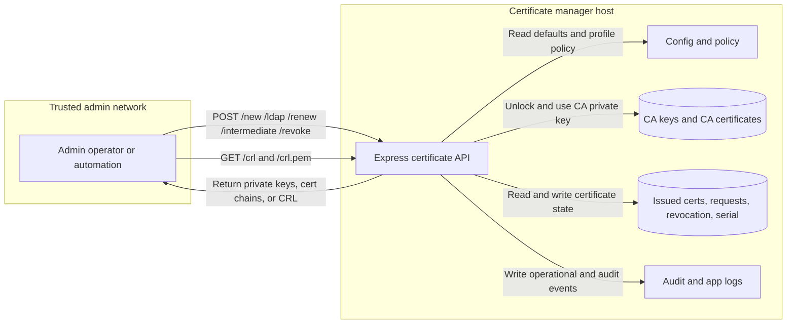
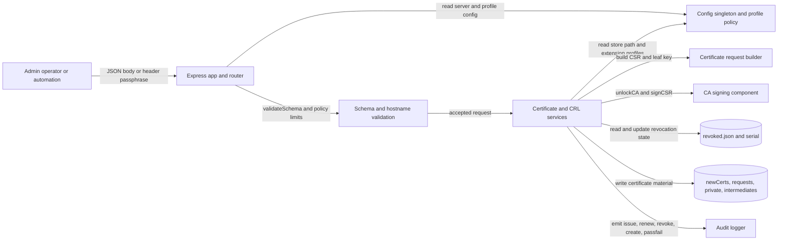
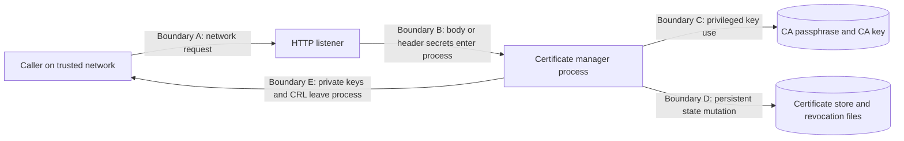
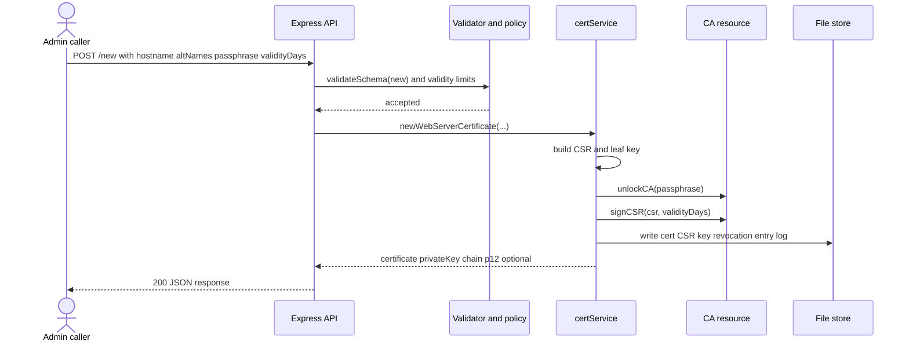
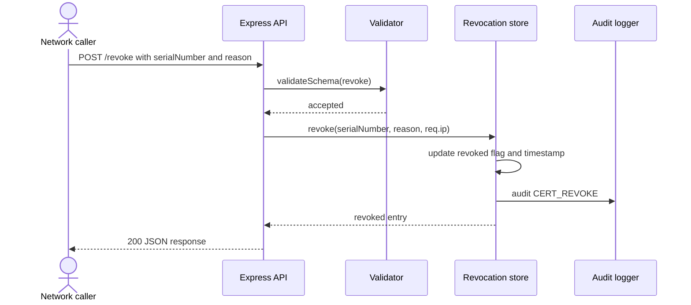
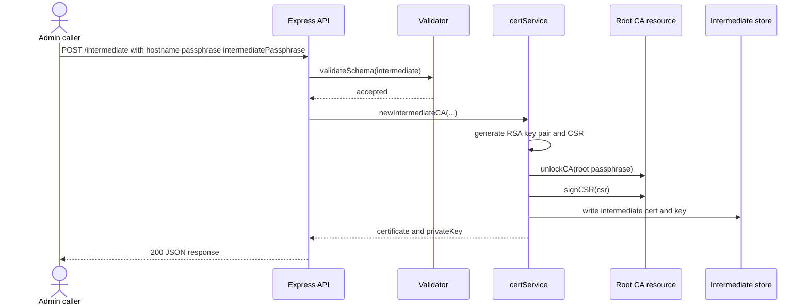

# Threat Model Review - 2026-03-27

## 0. Executive summary

- The service is a privileged internal certificate authority API that exposes certificate issuance, renewal, revocation, intermediate creation, and CRL generation over HTTP endpoints documented in `readme.md:117`, `readme.md:136`, `readme.md:149`, and `readme.md:173`.
- The current deployment assumption, confirmed during review, is `trusted admin host only`, `no app-layer auth; passphrase only`, and `HTTP on a trusted network`.
- The strongest confirmed controls are request schema validation, hostname allow-listing, encrypted CA private-key storage at setup time, audit logging, optional HTTPS support, and optional intermediate-only issuance enforcement.
- The highest-risk gap is missing authentication and authorization at the application boundary. All privileged routes are mounted directly, and `/revoke` does not require the CA passphrase at all.
- The CA passphrase crosses the network in request bodies for `/new`, `/ldap`, `/renew`, and `/intermediate`, and in the `x-ca-passphrase` header for `/crl.pem`, while the default runtime protocol is plain HTTP.
- Crypto-heavy operations have no visible rate limiting, queuing, or concurrency control, which leaves the service open to resource exhaustion and file-state contention.
- Sensitive outputs intentionally leave the trust boundary: the API returns private keys and can write unencrypted leaf keys and intermediate keys to disk. This is central to the product but materially increases the blast radius of transport or host compromise.
- The current working tree diff is low risk for the certificate API itself: dev dependency version bumps, prompt/agent files, and a new Dockerfile. The Dockerfile adds a runtime surface but not new authn/authz controls.
- Docker runtime details are only partially discoverable. The image exposes port `8080` and runs as non-root, but the default config still points at `X:\Certificates`, so container store-path wiring remains an operational unknown.

## 1. Scope

- In-scope components/containers:
  - Node.js HTTP server and Express app in `server.js` and `src/app.js`
  - Certificate router, controller, services, and resources in `src/routers`, `src/controllers`, `src/services`, and `src/resources`
  - Setup scripts that create root and intermediate CA material in `scripts/setup.js` and `scripts/setup-intermediate.js`
  - File-backed certificate store, revocation state, serial tracking, and audit/app logs
  - Container packaging in `Dockerfile`
- Out-of-scope:
  - Reverse proxy, firewall, network ACLs, and host hardening not represented in the repo
  - Backup, restore, off-host key escrow, and operational CA ceremonies
  - Consumers of the issued certificates
  - Windows or Linux filesystem ACLs on the configured store path
- Trust boundaries:
  - Caller on the trusted admin network to the HTTP API listener
  - Node process to sensitive file-backed key and certificate state
  - Node process to audit/app log sinks
  - Optional container boundary introduced by `Dockerfile`
- Key assets:
  - Restricted: root CA private key, intermediate CA private keys, CA passphrase, CRL-generation passphrase header
  - Restricted: issued leaf private keys and optional PKCS#12 bundles
  - Confidential: revocation inventory, certificate issuance log, audit log metadata, serial counter
  - Internal: hostname inventory, certificate chains, config defaults, certificate profiles
  - Public/Internal depending on distribution: issued leaf certificates and CRLs

## 2. Assumptions & Unknowns

- **ASSUMPTION:** The intended deployment is on a trusted admin host only, not internet-facing.
- **ASSUMPTION:** There is no application-layer authentication or authorization beyond possession of the CA passphrase for some routes.
- **ASSUMPTION:** Normal runtime traffic reaches the app over HTTP on a trusted network, not HTTPS terminated in-process or at a reverse proxy.
- **UNKNOWN:** Are upstream network controls enforcing caller allow-lists for all privileged routes? Who can confirm: platform owner. Where to look: deployment manifests or firewall policy outside this repo.
- **UNKNOWN:** What filesystem ACLs protect the configured store directory and generated key material? Who can confirm: infrastructure owner. Where to look: host or volume provisioning outside this repo.
- **UNKNOWN:** Is `LOG_LEVEL=debug` ever enabled in production-like environments? Who can confirm: service owner. Where to look: runtime environment configuration outside this repo.
- **UNKNOWN:** How is container deployment intended to override `config/defaults.json` so the Linux image does not rely on `X:\Certificates`? Who can confirm: platform owner. Where to look: `Dockerfile`, deployment env vars, and any untracked config overlays.

## 3. Architecture & Data Flows

### 3.1 DFD Level 0 (Context)

#### Evidence - DFD Level 0

- `src/routers/certRouter.js:13`, `:86`, `:141`, `:213`, `:238`, `:261`, `:271` define the externally reachable routes.
- `src/app.js:10-17` mounts `helmet`, JSON parsing, and the certificate router.
- `src/services/certService.js:45-46`, `:115-116`, `:256-257`, `:334-335` unlock and use the CA signing path.
- `src/resources/config.js:96`, `:119-148` and `config/defaults.json:1-120` define server protocol, store path, profiles, and issuance policy.
- `src/utils/logger.js:24-46` and `src/services/certService.js:77`, `:147`, `:282`, `:341` emit operational and audit events.

### 3.2 DFD Level 1 (Subsystems / Containers)

#### Evidence - DFD Level 1

- `src/resources/schemas.js:1-141` and `src/resources/validator.js:28-52` implement schema validation and hostname policy checks.
- `src/services/certService.js:29-84`, `:95-154`, `:167-290`, and `:301-348` implement issuance, renewal, and intermediate creation.
- `src/resources/certificateRequest.js:16-109` generates CSRs and private keys; `:191-217` creates PKCS#12 bundles.
- `src/resources/ca.js:149-198` verifies CSRs, applies configured extensions, signs certificates, and increments serials.
- `src/resources/revocation.js:34-69`, `:84-103` updates and queries revocation state.

### 3.3 Supporting diagrams

#### Trust boundary view

#### Evidence - Trust boundary view

- `config/defaults.json:2-4` sets default protocol `http` on port `8080`.
- `src/routers/certRouter.js:273` reads the CA passphrase from the `x-ca-passphrase` header for CRL generation.
- `src/services/certService.js:63-84`, `:133-154`, `:266-290`, `:337-347` return private keys and certificate material in API responses.
- `scripts/setup.js:97-106` and `scripts/setup-intermediate.js:44-45` write CA and intermediate key material to disk.

#### Deployment / runtime topology

- Discoverable topology is a single Node 22 container image running as `appuser`, exposing `8080`, and mounting `/app/files` as a volume (`Dockerfile:3-27`).
- **UNKNOWN:** The default runtime config still points `storeDirectory` to `X:\Certificates` (`config/defaults.json:6`), so a containerized deployment needs an external config override via `CONFIG_PATH` or a different defaults file (`src/resources/config.js:7-9`).

## 4. Key Flows (ranked)

### Flow 1 - Issue web or LDAP certificate

- Description: A caller posts a hostname, optional SANs, passphrase, and optional validity/bundle parameters to `/new` or `/ldap`; the service validates input, generates a CSR and private key, unlocks the CA, signs the certificate, persists material, records revocation metadata, and returns the new private key and certificate chain.
- Data elements involved: hostname and SANs (Internal), CA passphrase (Restricted), generated leaf private key (Restricted), certificate chain (Internal/Public), audit metadata (Confidential).
- Entry points and enforcement points: `/new` and `/ldap` routes; schema validation, validity-limit checks, hostname allow-list, optional intermediate enforcement, CA unlock, audit logger.
- Evidence: `src/routers/certRouter.js:13-83`, `:141-210`; `src/services/certService.js:29-84`, `:95-154`; `src/resources/certificateRequest.js:16-109`; `src/resources/ca.js:149-198`.

### Flow 2 - Create intermediate CA

- Description: A caller posts intermediate name, root CA passphrase, and new intermediate passphrase to `/intermediate`; the service generates a new RSA key pair, builds an intermediate CSR, unlocks the root CA, signs the subordinate CA certificate, stores the intermediate private key and certificate, and returns both to the caller.
- Data elements involved: root CA passphrase (Restricted), intermediate passphrase (Restricted), intermediate private key (Restricted), intermediate certificate (Internal).
- Entry points and enforcement points: `/intermediate` route; schema validation; root CA unlock; audit logger.
- Evidence: `src/routers/certRouter.js:213-236`; `src/services/certService.js:301-348`; `scripts/setup-intermediate.js:9-53`.

### Flow 3 - Renew certificate

- Description: A caller posts a serial number and CA passphrase to `/renew`; the service looks up the prior certificate, reuses the stored private key and SAN set, re-issues a certificate using the detected profile, updates revocation tracking, and returns the same leaf private key again.
- Data elements involved: serial number (Internal), CA passphrase (Restricted), stored leaf private key (Restricted), hostname and SANs (Internal), new certificate chain (Internal/Public).
- Entry points and enforcement points: `/renew` route; schema validation; revocation lookup; validity-limit checks; CA unlock.
- Evidence: `src/routers/certRouter.js:86-138`; `src/services/certService.js:167-290`; `src/resources/revocation.js:99-103`.

### Flow 4 - Revoke certificate and publish CRL

- Description: A caller can revoke by serial number via `/revoke`, which flips state in `revoked.json` and emits an audit event. A caller can fetch the logical CRL with `/crl`, or a signed PEM CRL via `/crl.pem` by sending the CA passphrase in a header.
- Data elements involved: serial number and reason (Internal), revocation records (Confidential), CA passphrase for `/crl.pem` (Restricted), signed CRL (Internal/Public).
- Entry points and enforcement points: `/revoke`, `/crl`, `/crl.pem`; schema validation for revoke only; optional CA unlock for PEM CRL.
- Evidence: `src/routers/certRouter.js:238-289`; `src/resources/revocation.js:45-69`; `src/services/crlService.js:175-194`.

## 5. Threats

### Attack narratives

- **TM-1 - Privileged API spoofing through shared-secret-only control:** Any caller that can reach the service and knows the CA passphrase can issue, renew, or create intermediate certificates because there is no authenticated identity, no role model, and no route-specific authorization gate at the HTTP boundary. In the confirmed deployment model this may be acceptable for a small trusted network, but it scales poorly and turns network reachability plus secret knowledge into full CA operator power.
- **TM-2 - Unauthenticated revocation abuse:** The `/revoke` route accepts only a serial number and optional reason, then mutates revocation state and emits an audit event. A reachable caller does not need the CA passphrase or any other identity proof, so a trivial script can revoke all known certificates and create an availability incident.
- **TM-3 - CA secret disclosure on the wire:** The application defaults to HTTP, while the root CA passphrase is transmitted in JSON bodies or an HTTP header. Anyone with visibility into the trusted network segment, proxy logs, packet captures, or misconfigured middleware can recover the passphrase and escalate to certificate issuance or intermediate creation.

| ID | Flow | Summary | STRIDE | OWASP | Likelihood | Impact | Status | Rationale |
| --- | --- | --- | --- | --- | --- | --- | --- | --- |
| TM-1 | Issue, renew, intermediate, CRL PEM | Privileged operations rely on a shared passphrase rather than authenticated caller identity or authorization policy. | Spoofing, Elevation of Privilege | A01:2021 Broken Access Control, API2:2023 Broken Authentication | M | H | Open | All privileged routes are mounted directly; no auth middleware or policy engine is visible in `src/app.js` or `src/routers/certRouter.js`. |
| TM-2 | Revoke | `/revoke` allows certificate revocation without CA passphrase or any other authn/authz control. | Tampering, Elevation of Privilege, DoS | A01:2021 Broken Access Control, API5:2023 Broken Function Level Authorization | H | H | Open | The revoke schema requires only `serialNumber`; the route calls revocation directly after validation. |
| TM-3 | Issue, renew, intermediate, CRL PEM | CA passphrase traverses the network in request bodies or headers while default transport is HTTP. | Information Disclosure, Spoofing | A02:2021 Cryptographic Failures, API8:2023 Security Misconfiguration | M | H | Open | `config/defaults.json` defaults to HTTP, and `/crl.pem` explicitly reads `x-ca-passphrase`. |
| TM-4 | Issue, renew, intermediate, CRL | Crypto-heavy endpoints have no rate limiting, back-pressure, or queueing and rely on flat-file state updates. | Denial of Service, Tampering | API4:2023 Unrestricted Resource Consumption | M | M | Open | RSA key generation, CSR signing, and repeated file writes occur synchronously from request flows with no throttling controls in the router or app. |
| TM-5 | Store and audit state | File-backed `serial`, `log.json`, and `revoked.json` have no integrity protection or locking, enabling tampering or race conditions if the host or runtime is compromised. | Tampering, Repudiation | A05:2021 Security Misconfiguration, A09:2021 Security Logging and Monitoring Failures | M | M | Open | State is loaded, mutated, and written back as plain JSON/text files without locking or append-only guarantees. |
| TM-6 | Response handling and storage | The service intentionally returns and stores private keys, increasing exposure if transport, host, logs, or downstream callers are compromised. | Information Disclosure | A02:2021 Cryptographic Failures | M | H | Open | Issue, renew, and intermediate flows return `privateKey`, and leaf or intermediate keys are persisted on disk. |
| TM-7 | CRL list and debug logging | `/crl` and debug logging can expose revocation inventory and hostname metadata to callers or log sinks beyond the minimum need-to-know audience. | Information Disclosure | API3:2023 Broken Object Property Level Authorization, A09:2021 Security Logging and Monitoring Failures | L | M | Open | `/crl` is unauthenticated, and `revocation._load()` logs the raw revocation payload when debug logging is enabled. |

## 6. Mitigations

| Threat ID | Mitigation | Status | Location / Evidence | Notes / Open questions |
| --- | --- | --- | --- | --- |
| TM-1 | JSON schema validation and explicit rejection of unknown fields on write routes | PRESENT | `src/resources/schemas.js:5`, `:45`, `:85`, `:110`, `:125`; `src/resources/validator.js:51-54` | Useful for input shape integrity, but not an authn/authz control. |
| TM-1 | Hostname allow-list tied to `validDomains` | PRESENT | `src/resources/validator.js:28-42`; `config/defaults.json:34-40` | Limits issuance domain scope but still trusts any authorized caller equally. |
| TM-1 | Strong caller authentication and route-level authorization for privileged actions | ABSENT | No evidence in `src/app.js` or `src/routers/certRouter.js` | Add mTLS, reverse-proxy auth, or signed workload identity plus explicit authorization policy per route. Effort: M. Blast radius: service-wide. |
| TM-2 | Require the CA passphrase or stronger operator identity for revocation | ABSENT | `src/resources/schemas.js:110-123`; `src/routers/certRouter.js:238-259` | Revocation should be at least as protected as issuance. Effort: S. Blast radius: `/revoke` clients. |
| TM-3 | Optional HTTPS support in-process | PRESENT | `server.js:29-37` | Helpful only when configured; default config remains HTTP. |
| TM-3 | Default secure transport and removal of passphrase from ordinary request bodies/headers | ABSENT | `config/defaults.json:2-4`; `src/routers/certRouter.js:273` | Require TLS by default and prefer host-local secret retrieval or mTLS-authenticated operator identity over sending the CA passphrase each request. Effort: M/L. Blast radius: deployment and clients. |
| TM-4 | Helmet headers on the Express app | PRESENT | `src/app.js:10` | Good hygiene, but it does not mitigate API resource exhaustion. |
| TM-4 | Rate limiting, request budgeting, and bounded concurrency for RSA and CRL operations | ABSENT | No evidence in `src/app.js`, `src/routers/certRouter.js`, or services | Add per-route quotas and serialized access to file-backed state. Effort: M. Blast radius: service-wide. |
| TM-5 | Audit logging for issue, renew, revoke, CA creation, and passphrase failures | PRESENT | `src/services/certService.js:77-83`, `:147-153`, `:282-289`, `:341-346`; `src/resources/revocation.js:63-68`; `src/resources/ca.js:13-21` | Improves detection but does not protect file integrity or ensure non-repudiation. |
| TM-5 | Encrypted CA private key at rest | PRESENT | `scripts/setup.js:22-24`, `:97`; `src/resources/ca.js:95-108` | Protects the root key at rest, but not leaf/intermediate keys or flat-file state integrity. |
| TM-5 | Durable integrity controls for `serial`, `log.json`, and `revoked.json` | ABSENT | `src/resources/ca.js:69-74`, `:211-225`; `src/resources/revocation.js:13-32`; `src/utils/storeValidator.js:43-50` | Move to a transactional store or add file locking and integrity validation. Effort: M. Blast radius: certificate state management. |
| TM-6 | Optional `requireIntermediate` enforcement to prevent root direct issuance | PRESENT | `config/defaults.json:41`; `src/resources/config.js:41-44`, `:147-148`; `src/services/certService.js:41-43`, `:111-113`, `:252-254` | Present, but current default is `false`. Consider defaulting to `true` outside lab use. |
| TM-6 | Minimum password enforcement for PKCS#12 export | PRESENT | `src/resources/schemas.js:29-32`, `:69-72`, `:136-139`; `src/resources/certificateRequest.js:197-201` | Minimum length `4` is weak for high-value key export; strengthen if bundle export is retained. |
| TM-6 | Avoid returning private keys over the API unless absolutely required | ABSENT | `src/services/certService.js:63-71`, `:133-141`, `:270-276`, `:347` | Consider one-time download, encrypted envelope delivery, or host-local generation. Effort: L/M. Blast radius: API contract. |
| TM-7 | `/crl` exposure control and least-privilege debug logging | ABSENT | `src/routers/certRouter.js:261-268`; `src/resources/revocation.js:15-24` | Restrict CRL inventory access and avoid logging raw revocation payloads in production. Effort: S. Blast radius: `/crl` consumers and observability pipeline. |

## 7. High-risk interaction sequences (tool-validated)

### 7.1 Certificate issuance

#### Evidence - Certificate issuance sequence

- `src/routers/certRouter.js:13-83`
- `src/services/certService.js:29-84`
- `src/resources/certificateRequest.js:16-109`
- `src/resources/ca.js:149-198`

### 7.2 Unauthenticated revocation

#### Evidence - Revocation sequence

- `src/routers/certRouter.js:238-259`
- `src/resources/schemas.js:110-123`
- `src/controllers/certController.js:66-73`
- `src/resources/revocation.js:45-69`

### 7.3 Intermediate CA creation

#### Evidence - Intermediate creation sequence

- `src/routers/certRouter.js:213-236`
- `src/services/certService.js:301-348`
- `scripts/setup-intermediate.js:9-53`

## 8. Validation plan (no code)

### Scenario 1 - Prove privileged actions require strong caller identity

- Intent: Validate the future control that issuance, renewal, intermediate creation, revocation, and CRL generation are all gated by authenticated operator identity and explicit authorization.
- Preconditions: Staging deployment with the chosen authn/authz mechanism enabled.
- Steps: Attempt each privileged route with no credentials, invalid credentials, a low-privilege identity, and a properly privileged identity.
- Expected result: Only the authorized identity succeeds; all failures are logged with reason and actor.
- Evidence to collect: HTTP responses, audit log entries, authorization policy config, screenshots or traces from the fronting identity system.
- Owner: service owner plus platform owner.

### Scenario 2 - Prove revocation is no longer anonymously callable

- Intent: Close the highest-severity current gap on `/revoke`.
- Preconditions: Candidate fix deployed to a non-production environment with known certificate serials.
- Steps: Send `POST /revoke` with only `serialNumber`; then repeat with the expected privileged identity or CA authorization proof.
- Expected result: Anonymous call fails; authorized call succeeds and the CRL state updates once.
- Evidence to collect: request/response capture, updated `revoked.json` or equivalent state record, audit event showing the actor identity.
- Owner: API maintainer.

### Scenario 3 - Prove secrets are not transported in cleartext

- Intent: Verify the CA passphrase or its replacement is protected end-to-end.
- Preconditions: TLS-enabled environment or replacement secret-handling pattern in place.
- Steps: Inspect runtime configuration, front-end proxy config, and a packet capture on the admin segment while exercising issue and CRL flows.
- Expected result: No plaintext CA secret appears in request bodies, headers, or proxy logs.
- Evidence to collect: server/proxy config, packet-capture summary, sanitized request logs, and documentation of the chosen secret-handling pattern.
- Owner: platform owner.

### Scenario 4 - Prove abuse resistance for crypto-heavy routes

- Intent: Validate rate limiting, concurrency caps, and safe error handling under burst load.
- Preconditions: Load test harness and staging environment.
- Steps: Burst `/new`, `/renew`, `/intermediate`, and `/crl.pem` with concurrent requests from one and many callers.
- Expected result: Excess requests are throttled or queued safely; the service remains healthy; no partial or corrupt state is written.
- Evidence to collect: rate-limit responses, service metrics, CPU/memory graphs, and state-store integrity checks before and after the test.
- Owner: platform owner plus service owner.

### Scenario 5 - Prove audit evidence is complete and useful

- Intent: Ensure high-risk actions are attributable and usable for incident response.
- Preconditions: Audit logging enabled to the intended sink.
- Steps: Execute one success and one failure case for issue, renew, revoke, intermediate creation, and CRL generation.
- Expected result: Audit events include timestamp, actor identity, operation, target, and outcome without leaking secrets.
- Evidence to collect: audit log samples, retention configuration, and any parsing/alerting rules.
- Owner: security owner plus service owner.

## 9. Owners

- Who confirms assumptions: platform owner, service owner, infrastructure owner.
- Who drives mitigations: API maintainer for route controls, platform owner for transport and deployment controls, security owner for control design and review.
- Who validates fixes: QA or service owner for behavior, platform owner for deployment posture, security owner for control verification.

## 10. Open questions

- Is every privileged route intentionally reachable from any host on the trusted admin network, or are upstream ACLs expected to narrow this further? Owner: platform owner. Where to look: deployment and network policy outside this repo.
- Should `/revoke` be callable without the CA passphrase or any operator identity, or is that an oversight? Owner: API maintainer. Where to look: `src/routers/certRouter.js:238-259` and `src/resources/schemas.js:110-123`.
- Is HTTP-only transport a deliberate lab constraint, or should HTTPS or mTLS become the default? Owner: service owner. Where to look: `config/defaults.json:2-4` and `server.js:29-37`.
- Is returning private keys in API responses still a hard product requirement, or can delivery move to a safer model? Owner: service owner. Where to look: `src/services/certService.js:63-71`, `:133-141`, `:270-276`, `:347`.
- How will container deployments reconcile `Dockerfile` volume `/app/files` with the configured `storeDirectory` of `X:\Certificates`? Owner: platform owner. Where to look: `Dockerfile:24-27`, `config/defaults.json:6`, `src/resources/config.js:7-9`.

## ✅ Quality checks

- Threats are tied directly to DFD flows and concrete route or service behavior.
- Every `PRESENT` mitigation above includes code or config evidence.
- Every `UNKNOWN` is phrased as a follow-up question with an owner.
- Boundary crossings from caller to API, API to secrets, and API to state are explicitly modeled.
- DFD Level 0, DFD Level 1, trust-boundary view, and all three sequence diagrams were validated with `mermaid-diagram-validator`.
- DFD Level 0 and DFD Level 1 were previewed successfully with `mermaid-diagram-preview`.
